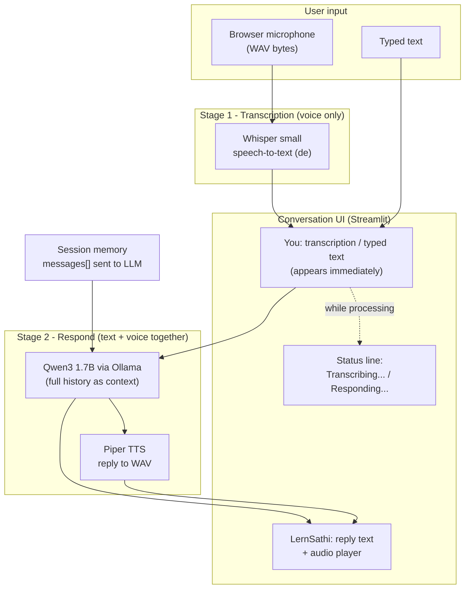
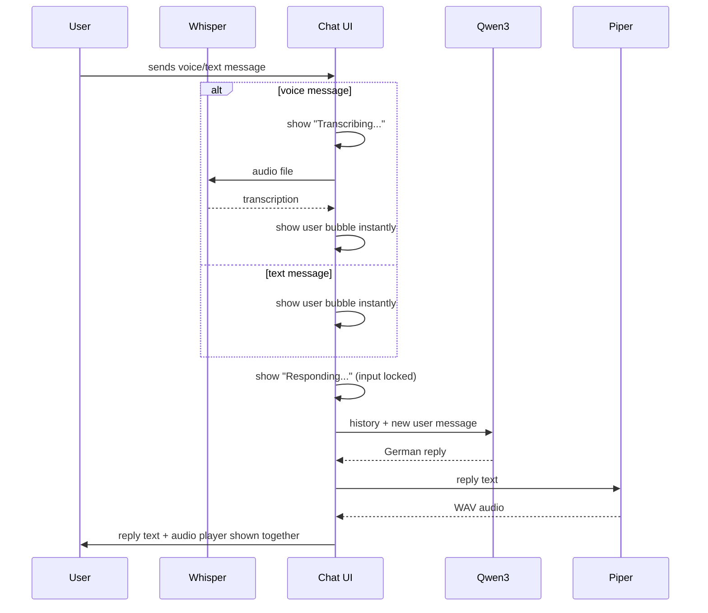

# LernSathi — Your German AI Conversation Tutor

LernSathi is a fully **local, private German-speaking AI tutor**. You chat with it by typing or by speaking into your browser microphone, and it replies in German — as text **and** as a spoken voice — adapted to your CEFR level (A1–C2). No cloud APIs are used for the AI itself: speech recognition, conversation, and speech synthesis all run on your own machine (or on a free Google Colab GPU).

---

## Features

- Voice conversations: record in the browser, get transcribed by **Whisper**, answered by **Qwen 3**, and spoken back by **Piper**
- Text conversations: type German and get instant corrections and replies
- CEFR-adaptive tutoring: system prompts tuned per level (**A1 → C2**)
- Progressive feedback: you see your transcription immediately, then a live "responding" status, then the reply with its audio together
- Conversation memory: every exchange is kept in context for natural follow-ups
- One-request-at-a-time processing lock so inputs never collide

---

## Architecture

| Stage | Model / Tech | Code |
|---|---|---|
| Speech → Text | OpenAI **Whisper `small`** (German) | `ai/speech/stt.py` |
| Conversation | **Qwen3 `qwen3:1.7b`** via **Ollama** | `ai/llm/model.py` |
| Text → Speech | **Piper** · Thorsten (de_DE, medium) | `ai/speech/tts.py` |
| Orchestration | `ConversationService` (staged API) | `services/conversation_service.py` |
| Web UI | **Streamlit** chat + custom mic component | `app.py`, `ui/` |

```
ai-tutor/
├── app.py                        # Streamlit entry point & composer logic
├── services/
│   └── conversation_service.py   # transcribe() / generate_reply() / speak()
├── ai/
│   ├── llm/model.py              # GermanChatbot + per-level system prompts
│   └── speech/
│       ├── stt.py                # Whisper wrapper
│       └── tts.py                # Piper wrapper
├── ui/
│   ├── chat.py                   # message rendering, level picker, CSS
│   ├── mic_widget.py             # Streamlit custom component bridge
│   └── mic_frontend/index.html   # browser recorder (timer + live waveform)
├── models/tts/de_DE-thorsten-medium.onnx
├── audio/input/                  # saved user recordings
├── audio/output/                 # generated reply audio
├── requirements.txt
└── lernsathi.ipynb               # one-click Google Colab edition
```

---

## Workflow

### Request pipeline



### What you see while it works



Key behaviour:

- **Text input skips Whisper entirely** — no transcription stage.
- **Voice input shows the real Whisper transcription before** the tutor starts responding.
- **The reply text and its audio appear as one unit** once both are ready.
- Only one request may be processed at a time (`is_processing` lock); the composer stays disabled until the pipeline finishes.

---

## Requirements

- Python **3.10+**
- [Ollama](https://ollama.com) installed and running
- **ffmpeg** available on PATH (required by Whisper)
- Microphone permission in your browser (for voice input)

Python dependencies (see `requirements.txt`): `streamlit`, `openai-whisper`, `torch`, `piper-tts`, `ollama`.

---

## Running — Option A: local script

From the project root:

```bash
# 1. Create/activate an environment (a ready venv named `lernsathi/` already exists)
python -m venv lernsathi
# Windows:
lernsathi\Scripts\activate
# Linux/macOS:
source lernsathi/bin/activate

# 2. Install dependencies
pip install -r requirements.txt

# 3. Start the Ollama server and pull the tutor model (one-time, ~1.4 GB)
ollama serve          # skip if Ollama is already running as a service
ollama pull qwen3:1.7b
```

Then launch the app:

```bash
streamlit run app.py
```

Open <http://localhost:8501>, pick your level (A1–C2), and start speaking or typing German.

> First reply takes ~30–60 s while Qwen warms up; afterwards it is fast. Whisper downloads its `small` weights (~460 MB) on first use.

## Running — Option B: Google Colab notebook

1. Upload/open **`lernsathi.ipynb`** in [Google Colab](https://colab.research.google.com).
2. Recommended: *Runtime ▸ Change runtime type ▸* **T4 GPU** (works CPU-only too, just slower).
3. *Runtime ▸ Run all* — installs Ollama, ffmpeg, cloudflared, all Python packages, recreates the project files, downloads the Piper voice, pulls Qwen3, smoke-tests the pipeline (~8–12 min total).
4. At the end, Step 8 prints a public **`https://…trycloudflare.com`** link.
5. Open that link on any device, **allow the microphone**, choose your level, and talk.

> Keep the notebook tab open while using the app — closing/disconnecting the runtime kills the tunnel. If the tunnel dies but the VM is alive, re-run Step 8 only.

---

## Troubleshooting

| Symptom | Fix |
|---|---|
| First answer slow | Normal — Qwen warms up on first request |
| Microphone never asks permission | You must be on the HTTPS tunnel URL in Colab mode; re-run Step 8 |
| `TTS model not found` | Ensure `models/tts/de_DE-thorsten-medium.onnx` exists (Colab downloads it in Step 5) |
| Ollama connection error | Ensure `ollama serve` is running and `qwen3:1.7b` was pulled |
| Audio appears a bit late in Colab | Network, not logic — the WAV streams through the free tunnel after the text |

---

## Privacy

Everything runs locally: recordings, transcripts, and generated audio never leave your machine (in Colab they stay inside your temporary VM session). Nothing is persisted between sessions.
